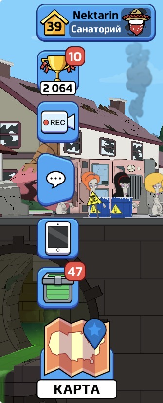

# Nikita Kharitonov | QA Engineer Portfolio

## About Me
Junior QA Engineer with hands-on experience in manual testing of web and mobile applications.

### Skills
- Test Case Design
- Bug Reporting
- Smoke Testing
- Functional Testing
- UI Testing
- Exploratory Testing
- Excel
- GitHub
### Languages
- Russian - Native
- English - B1
## Projects

### Weblodj Website Testing

Manual testing of a website including test case creation and bug reporting.

Files:

- [Test Cases](Test_Cases_Weblodj.xlsx)
- [Test Run and Bug Report](Test_Run_and_Bug_Report.xlsx)

### American Dad! Apocalypse Soon

Usability bug identified during independent testing of the mobile game.

- [Usability Bug Report](American_Dad_Usability_Bug_Report.md)

Bug Screenshot:

### Steam Workshop Sticker Project

Created and published a custom Counter-Strike 2 Workshop sticker.

- [Project Description](Steam_Workshop_Sticker_Project.md)

## Career Goal

Seeking a QA Intern / QA Trainee position to develop practical software testing skills and grow in Quality Assurance.

