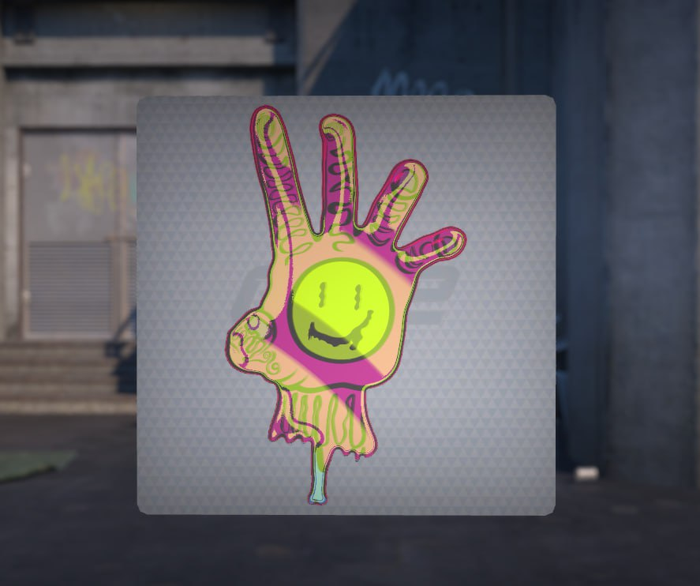
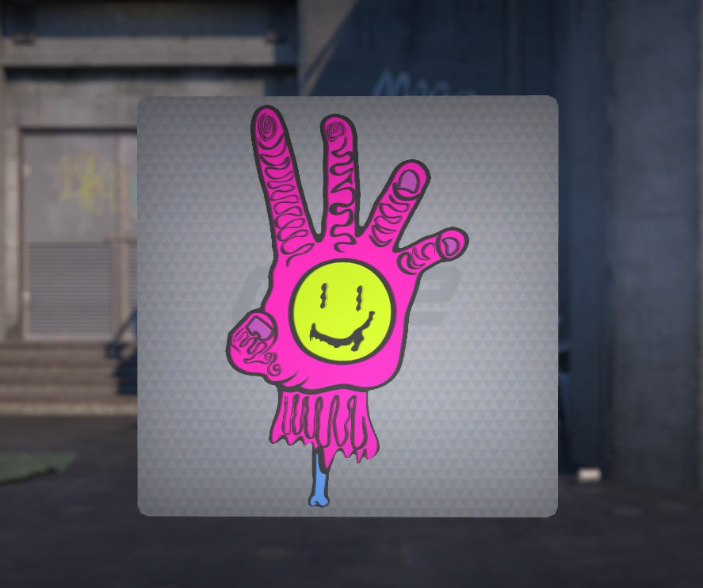

# Steam Workshop Sticker Project

## Overview

Independent project focused on creating and publishing a custom Counter-Strike 2 Workshop sticker for Steam Workshop.

## Objective

Design, test and prepare a sticker for submission to the Counter-Strike 2 Workshop.

## Project Screenshots

### Sticker Design HOLO

### Sticker Design

## Responsibilities

- Concept creation
- Sticker design preparation
- Image editing
- Alpha mask preparation
- Visual testing in Workshop tools
- Submission preparation

## Tools Used

- Adobe Photoshop
- Steam Workshop Tools
- Counter-Strike 2 Workshop

## Results

- Created a complete sticker concept
- Prepared all required Workshop assets
- Published the project to Steam Workshop
- Gained practical experience in testing visual assets and validating release requirements

## Skills Demonstrated

- Attention to detail
- Visual testing
- Defect detection
- Documentation
- Asset validation
- Release preparation
